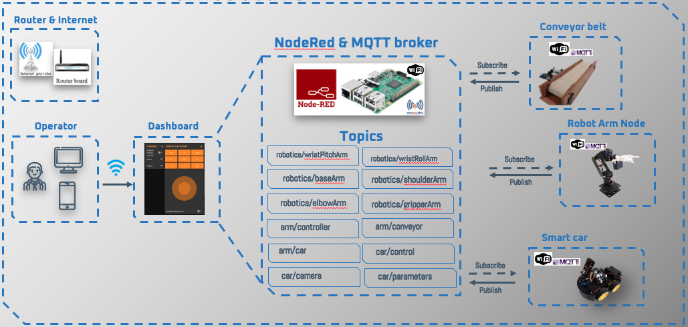

# Warehouse-Automation-Systems

### Idea
The idea behind this project is to automate the process involved in a warehouse and this consist in move products into, within, and out of the inventory with minimal human assistance. As part of an automation project an important aspect is the elimination of labor-intensive duties that involve repetitive physical work and manual entry and analisys. 
For example a robot can move products from one end of the warehouse to the shipping zone and software keeping all records current. Improve the efficiency, speed, reliability and accuracy of tasks. Enable the cooperation between the robot and human together to accomplish repetitive tasks while minimizing the fatique and injury. The Internet of Robotic Things (IoRT) is a technology that become a key factor in the supply chain to increase the productivity and reduce the operation costs. Sensors, robotic arm, autonomous vehicle and conveyor belt intelligent connected can enable IoRT in different context with rapid development and deployment.

### Project
The architecture designed and developed can be divided four main wireless network nodes:

* Conveyor belt
* Robot Car
* Robotic Arm
* Warehouse Server

    

The automation begins with the conveyor belt, the package is transported until it reaches the pick-up point, then the conveyor publish a message to the robotic arm. 
The robotic arm will pick the package and move it in front of the IP camera to scan the QR code, after the scan the arm will place the package on the robotic car that receive in real-time the right route to redirect the package to one of the parcel carrier terminal. 
Then after scanning the arm will place the package on the robotic car Finally the robotic car will return back to the home position and the conveyor belt will restart.  

#### Conveyor belt
Is a DIY model of conveyor belt with a IR sensor, the MCU used is an Arduino Uno WiFi that enable the MQTT technology and communication with the broker and MQTT cliets.

List of Components:

- Arduino Uno Wifi Rev.2
- IR Sensor
- DC Motor, 12 V
- Litio Battery 
- I/O Expansion Unit
- Cables

#### Robot Car
This kit provide all the component used to build the robot car, the difference is that we replace the Arduino Uno board with the Arduino Uno Wifi that enable the MQTT technology and communication with MQTT broker and MQTT clients.

List of Components:

- [Elegoo Smart Robot Car V4.0 with Camera] (https://www.elegoo.com/products/elegoo-smart-robot-car-kit-v-4-0) 

#### Robotic Arm
The robotic arm is another important components of the project, the MCU in use is the Espressif ESP32-WROVER connected with an expansion board that will give more I/O and also connected in WiFi to communicate with the MQTT broker and clients.

List of Components:

- ESP32-WROVER
- 6DOF Robotic Arm Kit
- MG996R Servo motor
- PCA9685 16-Channel Servo Driver
- Cables

#### Warehouse Server
This node provide many services and a dynamic dashboard to remotely control all the devices (coveyor belt, arm, car) via MQTT publish/subscribe mechanism. This allowed us to calibrate the whole system and send all the necessary parameter to the robots. 

All these services are installed on a Raspberry Pi board and the list of software components are:

- Mosquitto MQTT Broker
- Node-RED and service nodes
- MySQL Server

List of Components:

- Raspberry Pi
- Micro SD Card (16GB+)
- WiFi
- Raspberry Pi Case and Power Supply
- USB Keyboard and Mouse (Optional)

 
    
